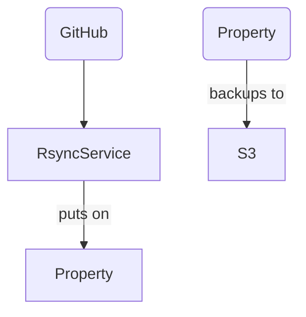

# Services and properties

## Jumphosts

## Rsync

### Workflow

On the Rsync.php.net machine are 3 directories located:

`local/services`
: Here are the scripts for the cronjobs.
  
`local/mirrors`
: This is the place for all the GitHub repositores

`/local/repos`
: 2 repos are here

## Services

### downloads.php.net

```sh
ansible-playbook addDownloads.yml
```

<details>
  <summary>
    <h3>What this does</h3>
  </summary>

  This playbook installs the following software on a machine:
  - apache 2
  - libapache2-mod-php8.2
  - php8.2
  - certbot
  - python3-certbot-apache
  - openssl
  - apache2-utils

  It puts the `apache.conf`, a file with some secrets to `/local/this-box`.
  Further, it copies the apache config files for `downloads.php.net` and `shared.php.net`.
  It creates letsencrypt-certs for `downloads.php.net` and self-signed SSL certs for `shared.php.net`.

</details>

## wiki.php.net

This playbook installs the following:

- apache2
- libapache2-mod-php8.2
- php8.2
- certbot
- python3-certbot-apache

It copies the apache config file to wiki.conf and creates letsencrypt certificates.
The domain and email is saved as variables.

## museum.php.net

## main.php.net

