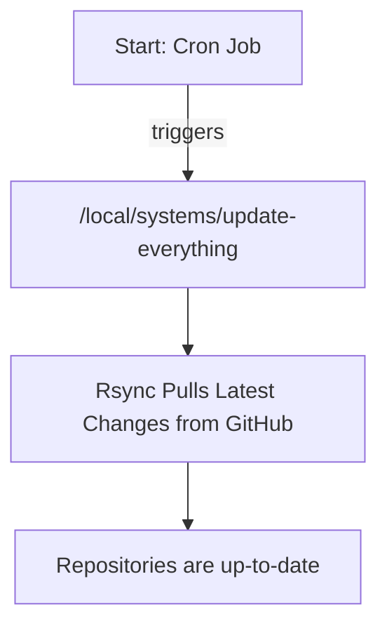
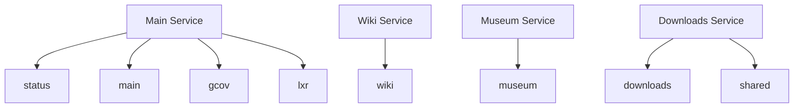

# Services and properties

Each property is implemented as an Ansible role located in the [roles/properties](roles/properties) directory.

Some properties have a `templates` directory. This is for files such as cron scripts or configuration files needed by the property.

## Jumphosts

## Rsync

This service keeps repositories up-to-date by performing a git checkout via a cron job. The update process is automated to ensure the latest version of the code is always available.

On the Rsync.php.net machine are 3 directories located:

`local/services`: The location of the scripts responsible for updating repositories and the rsync daemon config file.
  
`local/mirrors`: The directory where the repositories are stored and updated.

`/local/repos`: Another directory where the repositories are stored and updated.

### Workflow


## Services


### downloads

```sh
ansible-playbook addDownloads.yml
```

<details>
  <summary>
    <h3>What this does</h3>
  </summary>

  It puts the `apache.conf`, a file with some secrets to `/local/this-box`.
  Further, it copies the apache config files for `downloads.php.net` and `shared.php.net`.
  It creates letsencrypt-certs for `downloads.php.net` and self-signed SSL certs for `shared.php.net`.

</details>

### wiki

This playbook installs the following:

- apache2
- libapache2-mod-php8.2
- php8.2
- certbot
- python3-certbot-apache

It copies the apache config file to wiki.conf and creates letsencrypt certificates.
The domain and email is saved as variables.

### museum

### main

