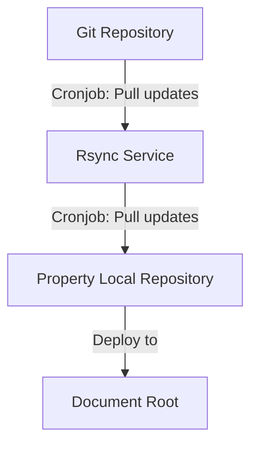
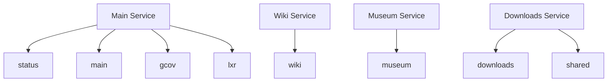

# Services and properties

Each property is implemented as an Ansible role located in the [roles/properties](roles/properties) directory.

All properties have a `templates` directory. This is for files such as cron scripts or configuration files needed by the property.

## Rsync

This service keeps repositories up-to-date by performing a git checkout via a cron job.
The update process is automated to ensure the latest version of the code is always available.

On the Rsync.php.net machine are 4 directories located:

`local/services`: The location of the scripts responsible for updating repositories and the rsync daemon config file.

`local/mirrors`: The directory where the repositories are stored and updated.

`/local/repos`: Another directory where the repositories are stored and updated.

#### Content workflow
rsync.php.net is a property. It pulls content from GitHub and puts the file to `/local/mirrors/{property}` on the rsync-machine. The property itself pulls the data from this folder via `rsync`. All this is handled by cronjobs.

To initialize `rsync` run the following playbook.

```sh
ansible-playbook initRsync.yml
```



## Services


### downloads

The `downloads` service contains the property `downloads.php.net`. It has Apache 2 with mod_php and PHP 8.2.20 installed.

To initialize `downloads` service run the following playbook to set up your machine:

```sh
ansible-playbook initServiceDownloads.yml
```

`shared.php.net` property is initialized as part of the `downloads` playbook.

#### Certificates

`downloads` uses certbot SSL certificates.

#### Cronjobs

`update-downloads` script is run hourly to update the data for this property.

#### Data and backup

For `downloads` the entire downloads home directory is backed up. The disk is full of windows downloads and RC downloads, which are stored in people’s home directories.

This is a redirect to `php.net`.

<details>
  <summary>
    <h3>What this does</h3>
  </summary>

  It puts the `apache.conf`, a file with some secrets to `/local/this-box`.
  Further, it copies the apache config files for `downloads.php.net` and `shared.php.net`.
  It creates letsencrypt-certs for `downloads.php.net` and self-signed SSL certs for `shared.php.net`.

</details>

### wiki

`wiki` is the PHP Wiki running dokuwiki for `wiki.php.net`. The playbook installs the following:

- apache2
- libapache2-mod-php8.2
- php8.2
- certbot
- python3-certbot-apache

To initialize `wiki` service run the following playbook to set up your machine:

```sh
ansible-playbook initServiceWiki.yml
```

It copies the apache config file to wiki.conf and creates letsencrypt certificates.
The domain and email is saved as variables.

#### Certificates

`wiki` uses certbot SSL certificates.

#### Cronjobs

`update-wiki` script is run daily to update data for this property.

#### Data and backup

For `wiki` the `data` and `media` folders from home root are backed up.

### museum

The `museum` playbook sets up the property `museum.php.net` with NGINX together with the fancyindex module.

To initialize `museum` service run the following playbook to set up your machine:

```sh
ansible-playbook initServiceMuseum.yml
```

#### Certificates

`museum` uses self-signed SSL certificate.

#### Data and backup

Currently there is no Ansible task to add data to the service. Data is added manually to the local folder.

### main

The `main` playbook sets up the `main.php.net` service. It has Apache 2 with mod_php and PHP 8.2.20 installed as well as the mariadb-server as its primary database.

To initialize `main` service run the following playbook to set up your machine:

```sh
ansible-playbook initServiceMain.yml
```

The following properties are all initialized as part of the `main` property:

- lxr.php.net
- status.php.net
- gcov.php.net

#### Certificates

Properties `main`, `lxr`, `status`, and `gcov` all have the same certificates as `lxr`. `lxr` uses certbot SSL certificates.

#### Cronjobs

`maintain-main` script is run hourly and weekly to update data for this property.

#### Data and backup

The backup done for the `phpmasterdb` MariaDB database using mysqldump. Currently the Ansible task creates an empty database and initially data have to be added manually.

## Backups

Backups are run as part of the property role tasks.

Backup process is different for `main` and other properties. For `main` backup is done for mysql database and apache2 config as per: https://github.com/php/systems/blob/master/backup-main and for other properties a tar file of the docroot folder is created and is backed up.

Backup tasks are run daily using a cronjob.

## Restore backup

Restores are run as part of deployment tasks of the properties. They are initially commented out so that they are not run on the first deployment of the property.

Once the first deployment and backup is done, the restore tasks can be commented in so that when next time deployment is run data can be restored directly from the backup.
