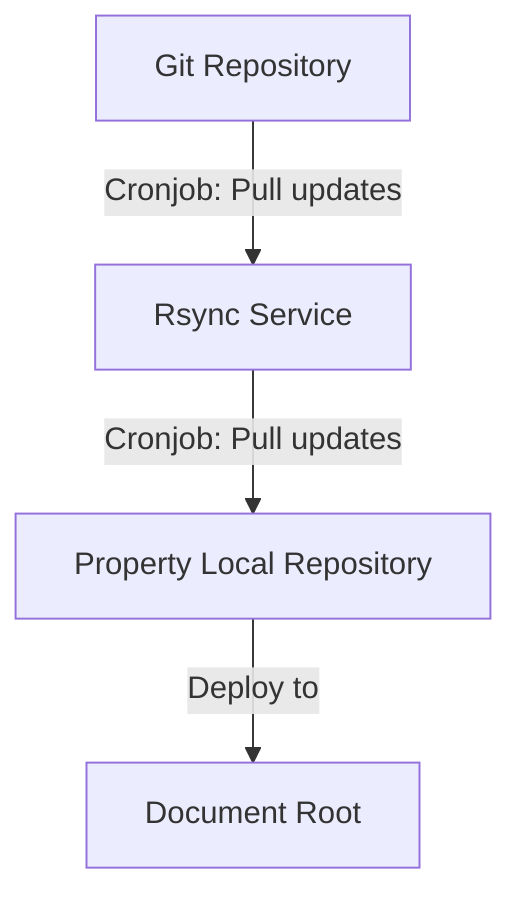
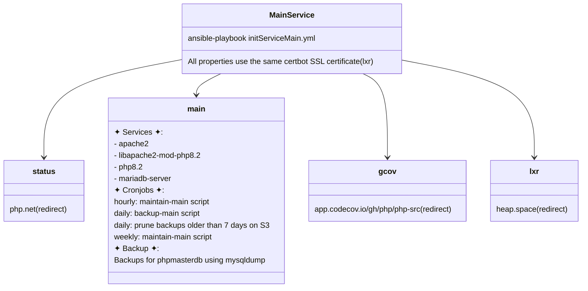
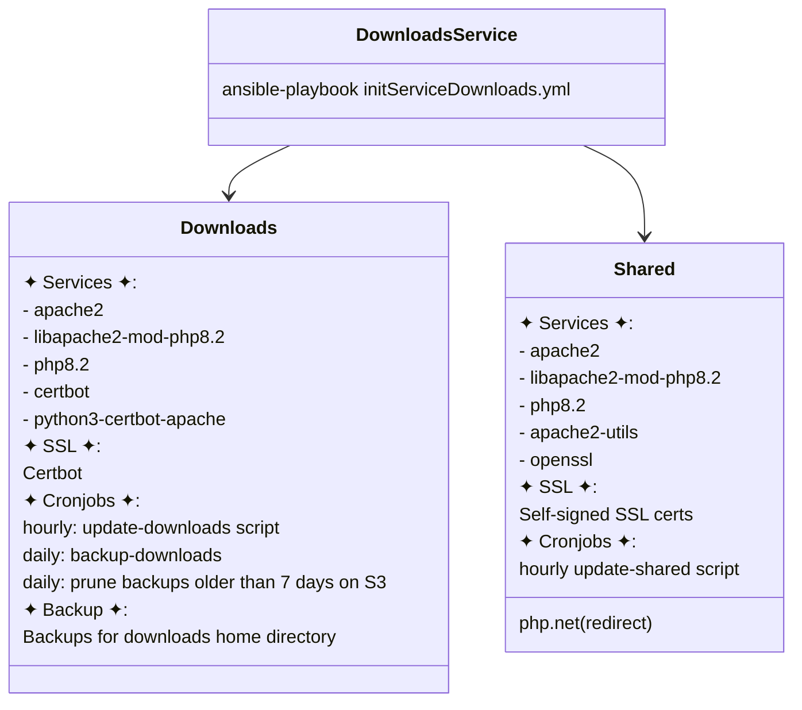
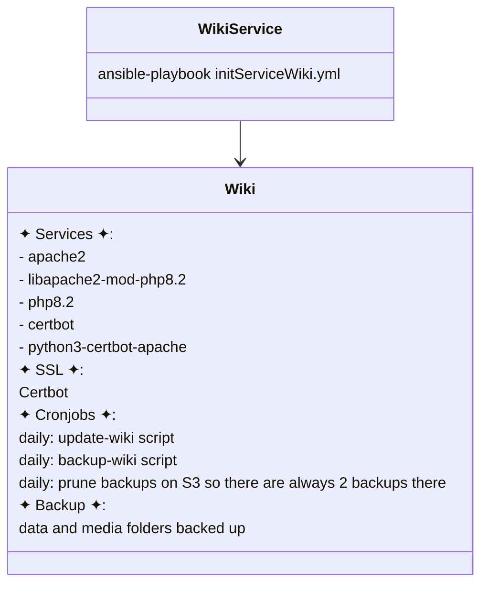
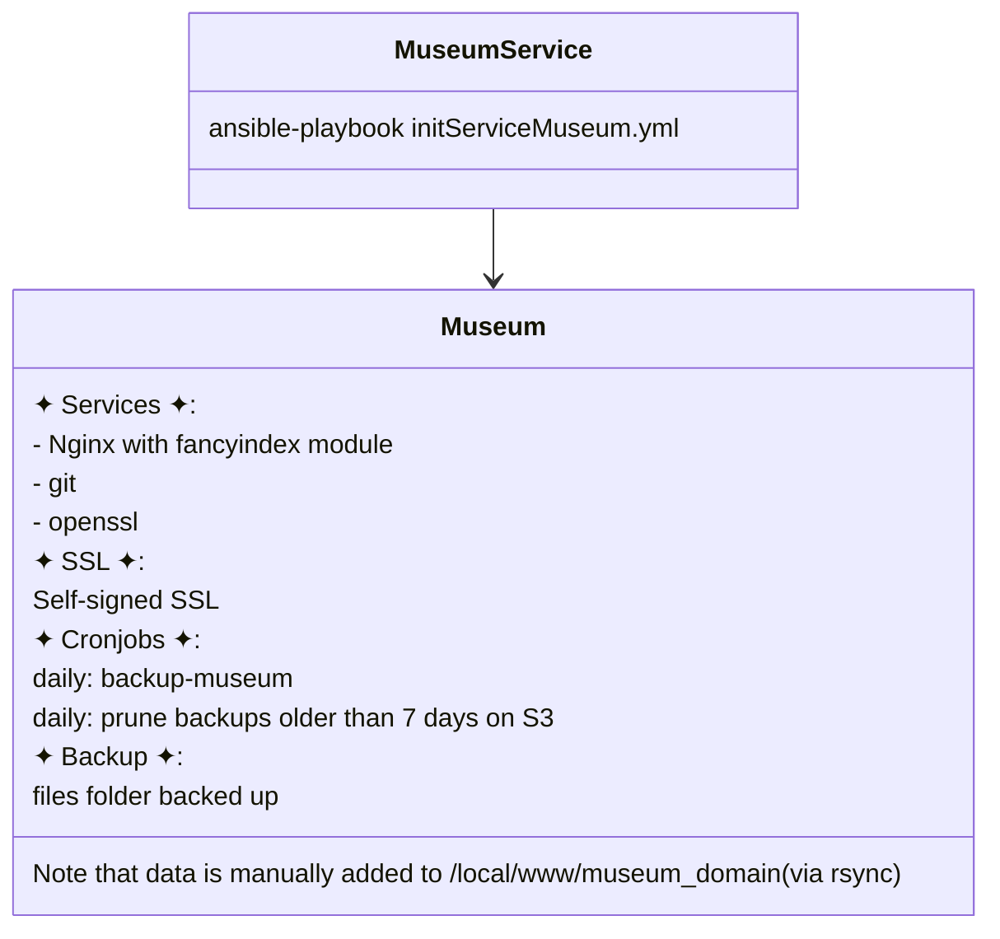

# Services and properties

Each property is implemented as an Ansible role located in the [roles/properties](roles/properties) directory.


## Overview

Each service is managed by its own dedicated playbook, which calls a role for each property associated with that service.
The flow of the roles follows a consistent structure across all services.
This includes basically:

- install software
- generate SSL certificates
- set up configurations
- deploy content
- manage backups and restores


### Directory Structure

Configuration files and scripts for each property are stored in the `templates` directory, while property-specific variables can be found in `vars/main.yml`. Handlers for reloading and restarting Apache or Nginx are located in `handlers/main.yml`.


### Backups

For backup tasks, we created dedicated folder for each property on a DigitalOcean Bucket. The content for each property is backed up to this folder using `restic`. This process can be easily customized by adjusting the restic backup command.

Backups are run as part of the property role tasks. The tasks are located at [roles/backup_property](roles/backup_property).
For the `main` and `wiki` properties, a specialized task list `backup.yml` is employed within their respective roles ( at `/tasks`).

Backup tasks run as a cronjob. There is an additional cron, that prunes backup files based on different conditions.


### Restore backup

The restore process follows a similar structure to backup, providing a reliable way to recover data. When restoring, content is fetched from the backup folders on the DigitalOcean Bucket and returned to the appropriate locations.

Restores are run as part of deployment tasks of the properties. They are initially commented out so that they are not run on the first deployment of the property.

Once the first deployment and backup is done, the restore tasks can be commented in so that when next time deployment is run data can be restored directly from the backup.


## Rsync Service

This service keeps repositories up-to-date by performing a git checkout via a cron job.
The update process is automated to ensure the latest version of the code is always available.

On the Rsync.php.net machine are 4 directories located:

`local/services`: The location of the scripts responsible for updating repositories and the rsync daemon config file.

`local/mirrors`: The directory where the repositories are stored and updated.

`/local/repos`: Another directory where the repositories are stored and updated.

#### Content workflow
rsync.php.net is a property. It pulls content from GitHub and puts the file to `/local/mirrors/{property}` on the rsync-machine.
The property itself pulls the data from this folder via `rsync`. All this is handled by cronjobs:



To initialize `rsync` run the following playbook.
```sh
ansible-playbook initRsync.yml
```


## Services


### Main Service

`main` is the PHP service running for `downloads.php.net` and `shared.php.net`.

The `main` property is at [roles/properties/main](roles/properties/main).
The `status` property is at [roles/properties/status](roles/properties/status).
The `gcov` property is at [roles/properties/gcov](roles/properties/gcov).
The `lxr` property is at [roles/properties/lxr](roles/properties/lxr).




### Downloads Service

`downloads` is the PHP service running for `downloads.php.net` and `shared.php.net`.

The `downloads` property is at [roles/properties/downloads](roles/properties/downloads).
The `shared` property is at [roles/properties/shared](roles/properties/shared).




### Wiki Service

`wiki` is the PHP Wiki running dokuwiki for `wiki.php.net`.
The wiki property is at [roles/properties/wiki](roles/properties/wiki).




### Museum Service

`museum` is the PHP Museum running on `museum.php.net`.
The museum property is at [roles/properties/museum](roles/properties/museum).


